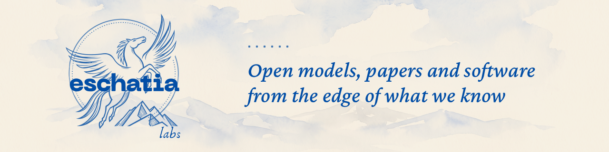

# Mert Kaya

Senior AI researcher and AI architect. Founder of [Eschatia Labs](https://eschatialabs.com). AI Engineer at Enocta. MSc in Computer Science, TED University; BSc in Computer Science, TOBB ETÜ.

I build small open models that report how sure they are, the agent tooling around them, and the platforms that serve them in production.

## Work

- **JevAlt**: three 4B decision models that answer typed questions with calibrated probabilities, speak the Jev API and run on a CPU in about 3 GB of RAM. [Deem-4B](https://huggingface.co/mertkayacs/Deem-4B) (English), [Karar-4B](https://huggingface.co/mertkayacs/Karar-4B) (Turkish), [Wähler-4B](https://huggingface.co/mertkayacs/Wahler-4B) (German), [site](https://jevalt.mertkayacs.com), [code](https://github.com/mertkayacs/jevalt). Playable demo: [Emberwick](https://emberwick.mertkayacs.com), a medieval village where the models decide what the villagers do. Karar-4B is the best open-source Turkish decision model in its class: 96.8% on Turkish held-out decisions against Kev-4B's 87.1%.
- **Tholos**: always-on small agents that share one workspace of tables, notes and a task board on your own machine, with allow, ask and deny rules for every action. [Code](https://github.com/mertkayacs/tholos), [site](https://tholos.mertkayacs.com), [Tholos-2B](https://huggingface.co/mertkayacs/Tholos-2B), a 2B agent model fine-tuned on executed trajectories.
- **xdfdet**: explainable deepfake detection. Eight trained EfficientNet-B4 detectors with Grad-CAM region analysis, from my MSc thesis. [Code](https://github.com/mertkayacs/xdfdet), [models](https://huggingface.co/mertkayacs/xdfdet), [site](https://xdfdet.mertkayacs.com).
- **reevesagents**: a local tmux workspace for AI coding CLIs. Run Claude Code, Codex, Kimi, OpenCode, Hermes and more side by side, and let one agent drive the others over MCP. [Code](https://github.com/mertkayacs/reevesagents), [npm](https://www.npmjs.com/package/reevesagents), [site](https://reevesagents.mertkayacs.com). 
- **JevOss**: an open test bench for any decision model that speaks the Jev API: accuracy, honest probabilities, and where it breaks. [Code](https://github.com/mertkayacs/jevoss), [site](https://jevoss.mertkayacs.com).

## Publications

- M. Kaya, V. Adanova. Augmentation and Cutout in Deepfake Detection: A Comparative Study of Accuracy, Calibration, and Attention. UBMK 2026, accepted, to appear in IEEE Xplore.
- M. Kaya. Explainable deepfake detection using frame level CNN models: A comparative study of augmentation and cutout techniques. MSc thesis, TED University, 2025 (advisor: V. Adanova). [DOI](https://doi.org/10.5281/zenodo.18998566)

## Links

[mertkayacs.com](https://mertkayacs.com) · [Hugging Face](https://huggingface.co/mertkayacs) · [Kaggle](https://www.kaggle.com/mertilovski) · [LinkedIn](https://www.linkedin.com/in/mertkayacs)
