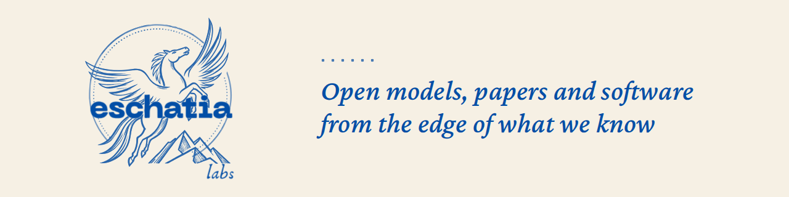

<a href="https://eschatialabs.com"><picture><source media="(prefers-reduced-motion: reduce)" srcset="assets/eschatia-labs-banner.png"></picture></a>

# Mert Kaya

Senior AI researcher and AI architect, founder of [Eschatia Labs](https://eschatialabs.com), AI Engineer at Enocta.

I build small open models and tools that run on your own machine. The deepfake detectors show where they look, and the decision models say how sure they are.

[mertkayacs.com](https://mertkayacs.com)&emsp;[eschatialabs.com](https://eschatialabs.com)&emsp;[Hugging&nbsp;Face](https://huggingface.co/mertkayacs)&emsp;[Kaggle](https://www.kaggle.com/mertilovski)&emsp;[LinkedIn](https://www.linkedin.com/in/mertkayacs)

## Work

### Deepfake detection

- **[xdfdet](https://xdfdet.mertkayacs.com)**: eight EfficientNet-B4 detectors from my MSc thesis, with Grad-CAM maps that show which face regions drive each verdict. Their highest AUC is 0.8981, on a FaceForensics++ test split. [Code](https://github.com/mertkayacs/xdfdet) · [Models](https://huggingface.co/mertkayacs/xdfdet)

### Decision models

- **[JevAlt](https://jevalt.mertkayacs.com)**: [Deem-4B](https://huggingface.co/mertkayacs/Deem-4B), [Karar-4B](https://huggingface.co/mertkayacs/Karar-4B) and [Wähler-4B](https://huggingface.co/mertkayacs/Wahler-4B) answer typed questions in English, Turkish and German with calibrated probabilities and run on a CPU in about 3 GB of RAM. Karar-4B is the best open-source Turkish decision model in its class: 96.8% on Turkish held-out decisions against Kev-4B's 87.1%. [Code](https://github.com/mertkayacs/jevalt)
- **[JevOss](https://jevoss.mertkayacs.com)**: an open test bench for any decision model that speaks the Jev API, JevAlt included. It scores accuracy and calibration and shows where a model breaks. [Code](https://github.com/mertkayacs/jevoss)
- **[Emberwick](https://emberwick.mertkayacs.com)**: a medieval village you play in the browser. The JevAlt models decide what the villagers do through storms, fires, markets and wolves at dusk.

### Local AI and open tools

- **[Tholos](https://tholos.mertkayacs.com)**: always-on small agents that share one workspace of tables, notes and a task board, with allow, ask and deny rules for every action. Its agent model [Tholos-2B](https://huggingface.co/mertkayacs/Tholos-2B) passes 137 of 160 Tholos-Bench scenarios on a Kaggle T4 and 134 on a CPU. [Code](https://github.com/mertkayacs/tholos)
- **[reevesagents](https://reevesagents.mertkayacs.com)**: a local tmux workspace for AI coding CLIs. Claude Code, Codex, Kimi, OpenCode, Hermes and more run side by side, and one agent can drive the others over MCP. [Code](https://github.com/mertkayacs/reevesagents) 

## Publications

- M. Kaya, V. Adanova. *Augmentation and Cutout in Deepfake Detection: A Comparative Study of Accuracy, Calibration, and Attention.* UBMK 2026, Istanbul. Accepted, to appear in IEEE Xplore.
- M. Kaya. *Explainable deepfake detection using frame level CNN models: A comparative study of augmentation and cutout techniques.* MSc thesis, TED University, 2025. Advisor: V. Adanova. DOI [10.5281/zenodo.18998566](https://doi.org/10.5281/zenodo.18998566)
